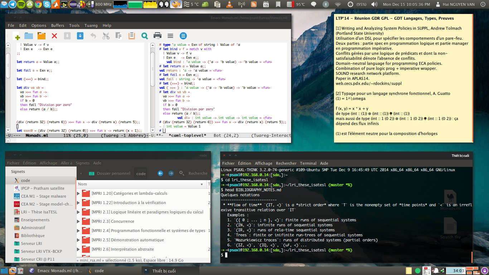
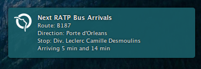

ThinkPad X1 with Ubuntu
==============

> Developers should never underestimate customizing their work tool. In this way, configuring your favorite Linux distribution should give you a better work experience. Here is a cheatsheet that gathers tips I applied to [Ubuntu 12.04 LTS (Precise Pangolin)](http://releases.ubuntu.com/12.04/) with [GNOME 3 Fallback Session (Classic)](https://launchpad.net/ubuntu/precise/+package/gnome-session-fallback) on my [Lenovo ThinkPad X1](http://www.lenovo.com/mp/x1/index.html).

----------------------

Contents
----------------------
This repository contains

1. :bulb: [`TIPS.md`](TIPS.md) : UX/UI tips to configure your operating system
2. :loop: [`COMMANDS.md`](COMMANDS.md) : a cheatsheet for some useful commands
3. :nut_and_bolt: various dotfiles I gathered and merged (based on my needs) in `dotfiles` directory : Bash, Emacs
4. various useful scripts in `scripts`, you can use in your `$PS1` variable or with a keyboard shortcut
   - :bus: [`next_ratp_bus.sh`](next_ratp_bus.sh) : displays stop time of [RATP](http://ratp.fr/) buses 
   - :tropical_fish: [`tunnel_ssh_make.sh`](tunnel_ssh_make.sh) : opens a SSH tunnel with a browser on it (pretty useful when you need to download files from various providers)
   - :vhs: [`notify_smart.sh`](notify_smart.sh) : small indicator with colors for SMART analysis on plugged drives
   - :satellite: [`get_tle.sh`](get_tle.sh) Space-Track TLE satellite information fetcher

----------------------

Disclaimer
----------------------
THE PROVIDER MAKES NO REPRESENTATIONS ABOUT THE SUITABILITY, USE, OR PERFORMANCE OF THESE TIPS OR ABOUT ANY CONTENT OR INFORMATION MADE ACCESSIBLE BY THESE, FOR ANY PURPOSE.

Hai Nguyen Van <nguyen-van@lri.fr>

